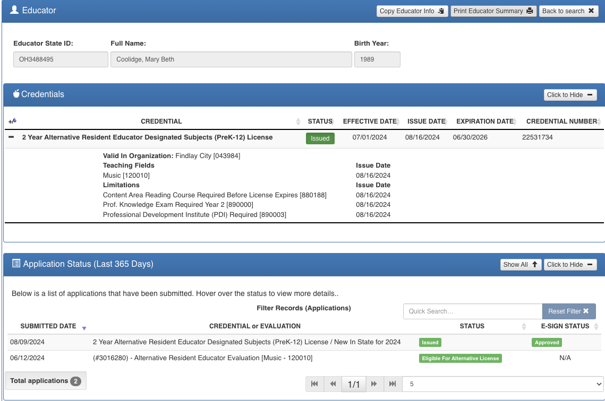

---
title: "Who Replaced Kevin Manley?"
date: 2024-11-20
---  

# **Who Replaced Kevin Manley?**
Following [Kevin Manley's](manley_rebuttal.md) resignation, Findlay City Schools (FCS) took an unconventional approach by hiring two directors to fill a role previously managed by a single teacher:
David Coolidge (47 years old) and his wife Mary Beth Coolidge. 

David Coolidge (47 years old) and his wife, Mary Beth Coolidge.  

!!! danger inline end  "FYI"
    David Coolidge is not a licensed teacher, according to the Ohio Department of Education's [Educator Search Tool](https://core.ode.state.oh.us/Core4/ODE.CORE.Lic.Profile.Public.UI/)
- David's professional background, as detailed on [FFE's Google Sites website](https://sites.google.com/findlaycityschools.org/findlayfirstedition/directors), includes:  
    - Fine Arts Specialist for Findlay City Schools  
    - Director of the Findlay First Edition show choir  
    - **Ten years** in higher education as Director of Musical Theatre at Ohio Northern and Anderson Universities  
    - Nearly twenty-five years as a professional freelance artist (actor, writer, and director)  
 
- Mary Beth's professional experience, also outlined on the website, features:  
    - Assistant Director of Findlay First Edition  
    - Operatic performances in Italy and with regional opera companies  
    - Faculty positions at multiple universities  
    - Masters of Music from the University of North Carolina at Greensboro  
    - Bachelors of Music from the Oberlin Conservatory of Music  
    - Certified teacher of Alexander Technique and Mindfulness  

<!-- more -->

### Compensation Analysis

!!! warning Document Accessibility Concerns
    A significant red flag in this transition is the systematic unavailability of crucial documents on the FCS Board of Education website:

    - PDFs with titles beginning with "Assistant Superintendent of Personnel and HR" consistently fail to load
    - Attempting to access these documents results in error messages
    - Critical meeting minutes and compensation documents appear to be systematically inaccessible
    - This lack of transparency prevents public scrutiny of the hiring and compensation process
      
#### Mary Beth Coolidge's Salary
At the September 16, 2024 FCS Board Meeting, HR Assistant Superintendent Krista Miller informed the board of Mary Beth's salary reclassification:

- Step 14 pay scale (14 years of teaching experience)
- Master's Degree + 30 credit hours
- Annual compensation: $80,000 ([reference](https://go.boarddocs.com/oh/findlay/Board.nsf/files/D5AJR84AE78A/$file/Teacher%20Salary%20Schedule%202024%202025%20With%20Index.pdf))
- Ohio teaching certificate obtained in August 2024

With Mary Beth Coolidge being 35 years old, the Step 14 pay scale becomes even more implausible. Given her extensive professional background in opera, higher education, and performing arts, it would be impossible for her to have accumulated 14 years of teaching experience starting at age 21.

#### David Coolidge's Compensation
As of publication:

- No teaching certificate from Ohio Department of Education
- Reported salary around $100,000
- No official documentation available in BoardDocs meeting minutes

**Comparative Compensation**  

- Previous Director (Kevin Manley): Approximately $91,000 with 33+ years of teaching experience  
- Current Leadership (Coolidge Couple): Combined salary of nearly $180,000  

The significant increase in administrative costs for what was previously a single director's role raises questions about the district's financial decision-making.  

!!! abstract "Key Takeaways"  
    ### Key Takeaways
    Based on the document, there are several suspicious circumstances surrounding Mary Beth Coolidge's salary classification that raise serious questions:

    **Timing and Credentials**  

    - Mary Beth just received her Ohio teaching certificate in August 2024  
    - She's been given a Step 14 pay scale (implying 14 years of teaching experience)  
    - Her professional background suggests an extensive career in performing arts and higher education, not K-12 teaching  

    **Unusual Salary Placement**  

    - The document highlights an apparent inconsistency: her biographical details make it "impossible" that she has 14 years of teaching experience starting at age 21, given her extensive professional history.

    **Possible Interpretations:**

    - Potential favoritism/neoptism
    - Circumventing typical salary placement rules
    - Possibly compensating her at a higher rate than her actual teaching experience warrants

    The salary classifications raise significant questions about the Findlay City Schools' hiring and compensation practices, especially considering:

    - FCS hired two people to replace one previous director  
    - Combined, the Coolidge couple will earn nearly $180,000  
    - The previous director, Kevin Manley, earned about $91,000 with 33+ years of experience  

    The generous salary placement appears suspicious and seems to lack transparency, especially given the documented issues with accessing official documentation.

   

## FCS Administrators Continue to Have Contempt for FFE  

**A recent Homecoming event at Findlay High School has sparked controversy and renewed concerns about the treatment of students and alumni, particularly those associated with the Findlay Fighting Farmers (FFE) organization.**
!!! tip inline end "Context"
    *This information is based on information gathered from various sources, including eyewitness accounts and social media discussions. Further investigation may be necessary to fully understand the situation.*
A former FFE member, returning to their alma mater for Homecoming, found themselves at the center of an unexpected and unpleasant encounter with FHS principal, Megan Simon. The alumnus, eager to participate in the festivities, was allegedly pressured to change their red FFE shirt due to a perceived violation of the school's "blue and gold" theme. This follows the pattern previously discussed around [employees, students, and parents](../../sections/Key%20Information%20from%20the%20PIR.md#3-derogatory-comments-about-ffe-personnel) who have shown support for FFE in the presence of or communication with FCS administrators. 

This incident has reignited tensions between the school administration and some parents and students within the FFE community. It has raised questions about administrators treatment of students and alumni, and whether the continued bias against the organization.

FFE has historically been a source of pride for Findlay High School, and its members have made significant contributions to the school's reputation. However, recent events suggest a growing divide between the administration and the organization.