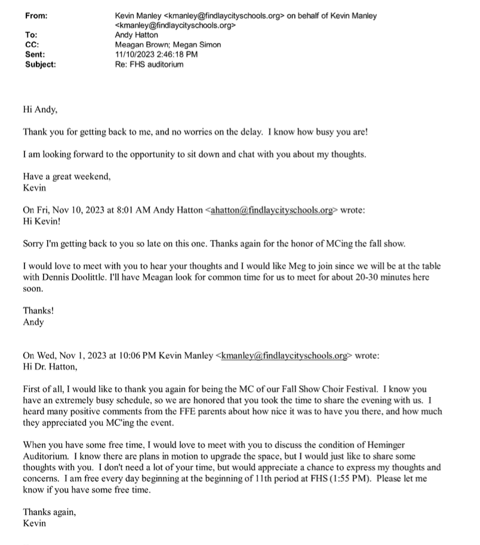
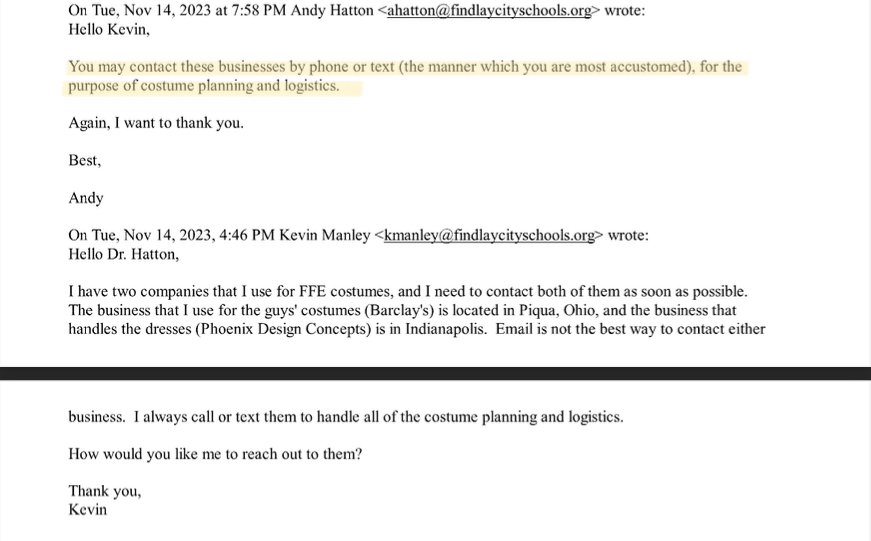
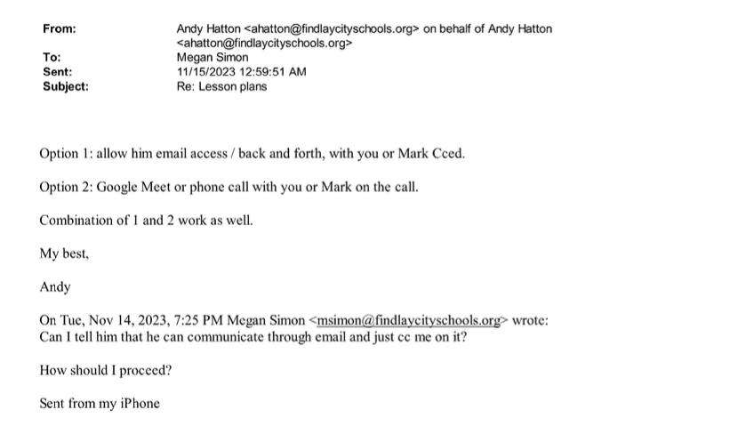
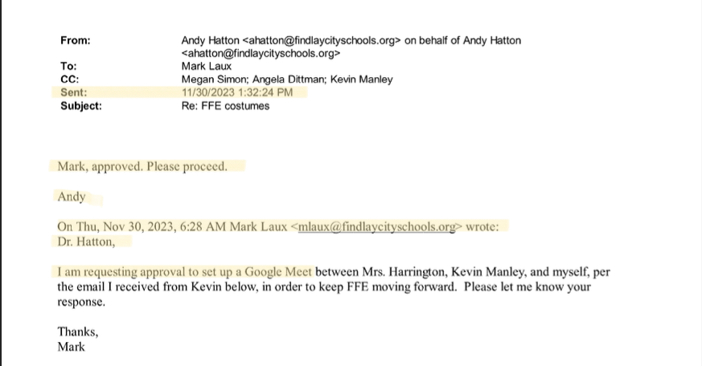
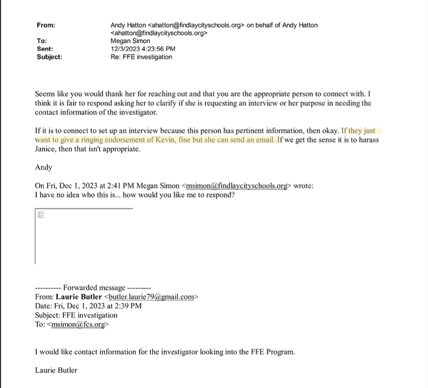
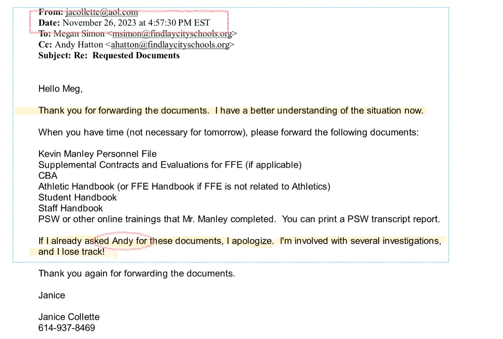
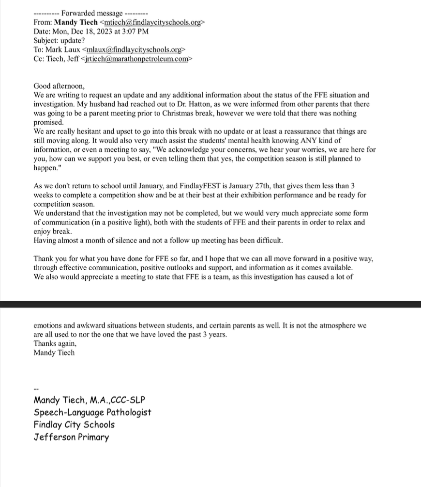
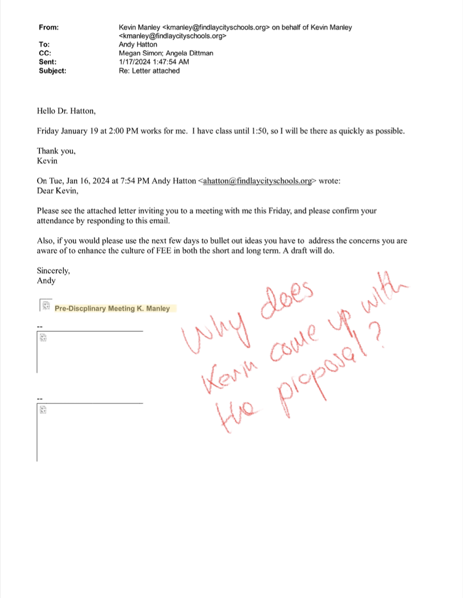
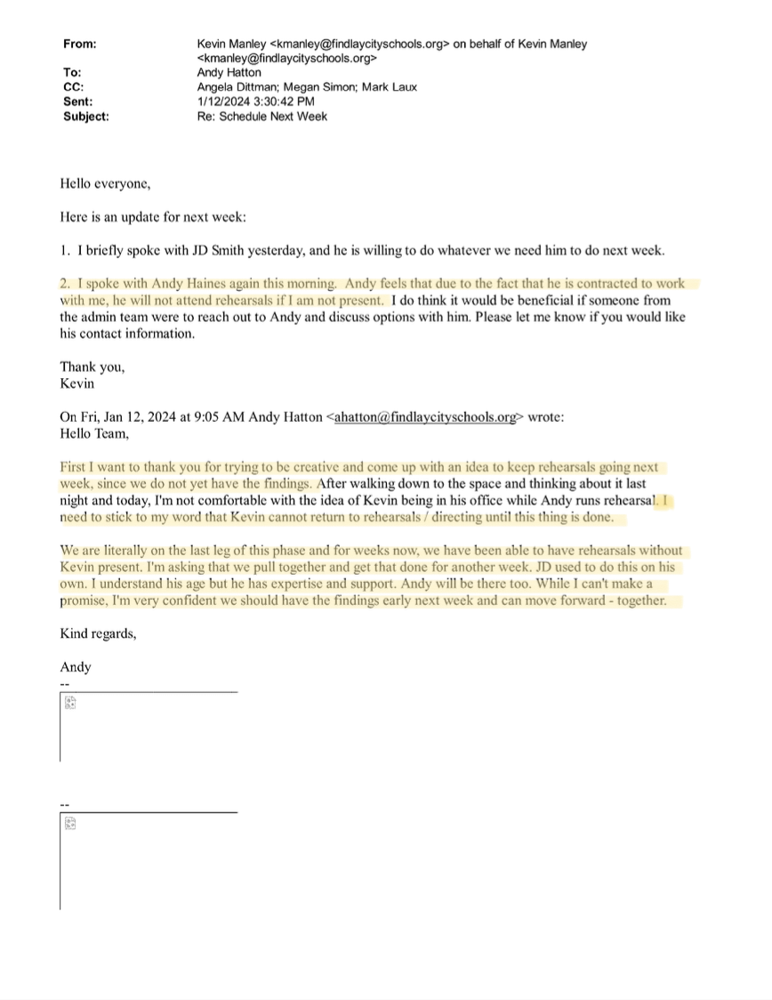

# What is **not** in the information requested from Findlay City Schools

!!! tip inline end
    While many documents were heavily redacted to protect individual privacy, any existing documents describing cultural problems should have been included, even if partially redacted.  

1. **Investigator Contract Absent**
	- No contract or agreement was provided showing the terms of engagement between Findlay City Schools and the investigator or investigative agency.
2. **Lack of 'Culture' Issue Details**
	- The response did not include specific information about the alleged "culture" issues within Findlay First Edition (FFE).
## These omissions are significant because:
- The missing contract raises questions about the scope and parameters of the investigation.
- The absence of details about cultural issues leaves the nature and extent of the problems unclear, despite being a central concern in the investigation.  

???+ abstract "Information Withheld by Findlay City Schools in Response to Public Records Request"
	The denial responses received to the public information request were standard. These types of statements are often referred to as "boilerplate" denials or qualifications commonly used by public entities when replying to information requests. The intended purpose is to cover a wide range of potential legal and procedural issues.

	??? quote "Read Boilerplate Denials"
		Please be advised, your request is denied because it is overly broad and ambiguous. In providing a response to a request, the District is not required “to do research or to identify records containing selected information” or produce an entire category of records. See State ex rel. Fant v. Tober, 8th Dist. Cuyahoga No. 63737, 1993 WL 173743, *1 (Apr. 28, 1993), aff'd, 68 Ohio St.3d 117 (1993). Instead, a requester must identify the records he or she is seeking “with reasonable clarity.” State ex rel. Glasgow v. Jones, 119 Ohio St.3d 391, 2008-Ohio-4788, ¶17. Requests for general categories of content or which seek all records “regarding or related to” a specified topic are overbroad. Morgan v. Strickland, 121 Ohio St.3d 600, 2009-Ohio-1901, at ¶ 14–15. Likewise, requests seeking all correspondence between certain senders/recipients over expansive periods of time and/or involving vague subject matters or keywords do not permit the District sufficient clarity to identify responsive records. See Patton v. Univ. of Akron, Ct. of Cl. No. 2017-00820PQ, 2018-Ohio-1555, ¶ 10; Hicks v. Newtown, Ct. of Cl. No. 2017-Ohio-00612-PQ, 2017-Ohio-8952, ¶ 8. As such, your request lacks specificity and particularity, and invariably requests documents or categories of documents that do not exist or do not align with the District’s record retention schedule (attached)  

		Your request is further denied in part to the extent it seeks documents and records that are protected from release in accordance with state and/or federal law. For example, records covered by the attorney-client are protected from release. This includes legal advice of any kind and communications between the District and its legal counsel. State ex rel. Leslie v. Ohio Hous. Fin. Agency, 105 Ohio St.3d 261, 2005-Ohio-1508. Similarly, any records containing either the education records or the non-directory, personally identifiable information of students are not subject to release. 20 USC 1232g (FERPA); R.C. 3319.321. Any record that “directly relates” to a student is considered the educational record of that student and is therefore confidential. 34 C.F.R. § 99.3. Id. This protection also pertains to information that, alone or in combination, is linked or linkable to a specific student that would allow a reasonable person in the school community, who does not have personal knowledge of the relevant circumstances, to identify the student with reasonable certainty. Federal law further protects from release any information requested by a person who the District reasonably believes knows the identity of the student to whom the education record relates. This further includes the personal notes of District employees and officials, which are not considered public records for the purposes of R.C. 149.43. See Hunter v. Ohio Bur. of Workers’ Comp., 10th Dist. No. 13AP-457, 2014-Ohio-5660, 16-17, 23-35.  

		Finally, your request is denied in part to the extent you seek records that do not constitute public records, are protected from release, and/or do not exist. A public office is not obligated to create records in response to a request for unrecorded or not-currently-recorded information, rather than a request for specific existing records containing such information. State ex rel. White v. Goldsberry, 85 Ohio St.3d 153, 154, 1999-Ohio-447 (a public office has “no duty under R.C. 149.43 to create new records.”). Additionally, the District has no obligation to identify those documents not produced or that do not exist, as this would amount to the creation of a privilege log, which the District has “no duty under R.C. 149.43 to submit.” State ex rel. Lanham v. DeWine, 135 Ohio St.3d 191, 2013-Ohio-199.  
---

## Suspicious Timing: Crisis Intervention Team Information Shared Prior to Reported Issues
On October 19, a significant exchange occurred between key figures in the Findlay City Schools administration:

- **Sender**: Assistant Superintendent
- **Recipient**: Dr. Hatton (Superintendent)
- **Content**: 'Crisis Intervention Team' pamphlet

### Key Observations:

1. **Relevance to FFE**:
	- This correspondence was included in the Public Information Request (PIR) response.
	- The PIR specifically requested information related to Findlay First Edition (FFE).
	- Its inclusion suggests a direct connection to the FFE situation.

2. **Timing Discrepancy**:
	- This exchange took place one month before any issues were officially reported.
	- The timing raises questions about the administration's foreknowledge or preparation for potential FFE-related events.

3. **Visual Evidence**:
	- Two images are provided as proof of this correspondence:
		1. The initial information exchange
		2. The first page of the Crisis Intervention brochure  
  

## Shifting Dynamics: Manley-Hatton Relationship and Confirmation of Proper Reporting

### Cordial Relationship Prior to Investigation

- **November 1**: Kevin Manley thanked Dr. Hatton for being the Master of Ceremonies at the FFE Fall Fest.
	- Notably, Manley referred to the Superintendent as "Andy," indicating a friendly, informal relationship.

- **Post-November 10**: Even after the initial meeting about FFE concerns, Manley continued to address Hatton as "Andy."
	- This suggests the relationship remained cordial despite emerging issues.  

	

### Confirmation of Proper Reporting by Manley

- **November 8**: A crucial email from FCS Principal Meg Simon revealed:
	- Simon expressed a desire to discuss with Manley "the contents of the FFE parent communication you received."
	- This email serves as evidence that Manley properly reported issues within the show choir to the administration.
	- Importantly, this correspondence was omitted from the FFE Investigation report.

### Significance of the Omission
The exclusion of this email from the investigation report raises serious questions about the thoroughness and impartiality of the investigation. As discussed in the original analysis of the report's inaccuracies and omissions (1), this omission appears to be intentional and potentially misleading.  

	<iframe width="560" height="315" src="https://www.youtube.com/embed/IfcRuU7wA_U?si=soU0GM28Gd8X-ysh&amp;controls=0&amp;start=607" title="YouTube video player" frameborder="0" allow="accelerometer; autoplay; clipboard-write; encrypted-media; gyroscope; picture-in-picture; web-share" referrerpolicy="strict-origin-when-cross-origin" allowfullscreen></iframe>

!!! abstract "Key Takeaways"
	1. The initial cordial relationship between Manley and Hatton, as evidenced by informal communication.
	2. Confirmation that Manley properly reported FFE issues, contradicting any claims of negligence.
	3. The deliberate omission of crucial evidence from the investigation report, raising concerns about its credibility and objectivity.  

---

## FCS Assistant Superintendent's Problematic Involvement in the FFE Investigation
### Initial Identification of the "FFE Problem"
- **November 2**: Assistant Superintendent first mentions an "FFE problem" via text message.  
  

### Acknowledged Conflict of Interest
- **20 minutes later**: Dr. Hatton texts Principal Meg Simon, stating the issue "hits close to home for [Assistant Superintendent]."
- This acknowledgment suggests:
	1. Assistant Superintendent has strong personal feelings about the matter.
	2. Potential for unconscious or conscious bias in her approach.
	3. Difficulty in separating personal feelings from professional responsibilities.
	4. Implicit recusal of the Assistant Superintendentfrom the "FFE problem" to maintain integrity.   
  

### Continued Involvement Despite Acknowledged Conflict
#### 1. Document Handling:  
- **November 20**: Dr. Hatton instructs Assistant Superintendent to file Kevin Manley's administrative leave notification.  
  

#### 2. Coordination with Former Boingers Director:  
- **November 12**: Alycia (Althaus) Fox informs Meg Simon that Assistant Superintendent reached out about the FFE Investigation.  
  
- Assistant Superintendent assists Althaus with her resignation as Boingers director.  
  
- Coordination of resignation announcement for maximum impact on Kevin Manley.  
  

### Inappropriate Reactions and Comments
#### 1. Reaction to Staff Support for FFE:  
- Assistant Superintendent's extreme reaction to Dr. Hatton's secretary wearing red in support of FFE.
- Dr. Hatton's inappropriate response: "Please don't shit your pants. That's gross."
- Notable: The secretary's position was eliminated shortly after this incident.  
  

#### 2. Insensitive Comments about FFE Performance:  
- Dr. Hatton sends "Ts & Ps" (thoughts and prayers) when Assistant Superintendent attends an event where FFE is performing.
- This comment further highlights the prejudice towards FFE by those overseeing the investigation.  
  

#### 3. Derogatory Comments about FFE Personnel:  
- **January 12**: Assistant Superintendent refers to Andy Hanes as the "god damn choreographer" in a text to Dr. Hatton.
- This exchange demonstrates ongoing personal bias influencing the investigation.  
   

!!! Summary
	This series of events and communications demonstrates a clear pattern of inappropriate involvement and bias from the Assistant Superintendent in the FFE investigation. Despite an early acknowledgment of her conflict of interest, Assistant Superintendent remained deeply involved in various aspects of the situation. The communications also reveal a concerning level of prejudice and unprofessional behavior from both the Assistant Superintendent and Dr. Hatton, raising serious questions about the objectivity and fairness of the entire investigative process.

---
## Premature Disclosure of Administrative Action: A Timeline Discrepancy  
!!! warning "Critical timeline discrepancy uncovered"
	Raising serious questions about the handling of sensitive personnel matters and potential bias in the FFE investigation.

### Key Events on November 12:
- **10:37 AM**: Assistant Superintendent contacts Alycia Althaus about Manley's administrative leave.
- **6:31 PM**: Kevin Manley is officially notified of his placement on administrative leave.  
  

### Analysis of the Discrepancy
- **Premature Disclosure**: Assistant Superintendent discussed Manley's administrative leave with Althaus nearly 8 hours before Manley himself was informed. This represents a significant breach of professional ethics and possibly legal protocols.
- **Violation of Confidentiality**: Personnel actions, especially disciplinary measures, are typically highly confidential. The early disclosure to Althaus suggests a concerning lack of discretion and potentially improper information sharing.
- **Potential Prejudice**: Informing Althaus, a former colleague, before the affected party (Manley) suggests a possible attempt to shape narratives or gather support against Manley before he could respond.
- **Procedural Irregularity**: Standard practice dictates that an employee should be the first to know about actions affecting their employment status. This deviation raises questions about the fairness and professionalism of the process.

### Broader Implications  
- **Administrative Integrity**: This incident casts doubt on the administration's ability to handle sensitive matters appropriately and maintain confidentiality.
- **Potential Bias**: The premature disclosure to Althaus may indicate a predetermined stance against Manley, raising concerns about the objectivity of the entire investigation.
- **Legal and Ethical Concerns**: This breach of protocol could potentially expose the school district to legal challenges regarding their handling of personnel matters.

!!! failure "Summary"
	This timeline discrepancy is not merely a procedural misstep but a serious indication of potential misconduct in the handling of the FFE investigation. It underscores the need for a thorough review of the administration's actions throughout the FFE investigation and raises questions about the fairness and integrity of the entire process.  

---

## Dr. Hatton's Excessive Control Over Kevin Manley's Communications  
Dr. Hatton's actions during the FFE investigation reveal a pattern of micromanagement and undue control over Kevin Manley's professional interactions. This level of oversight extends beyond normal administrative procedures, potentially hampering Manley's ability to perform his duties effectively.

### 1. Controlling External Vendor Communications  
- **Date**: November 14
- **Incident**: Dr. Hatton personally approved the method and purpose of Manley's correspondence with an FFE vendor.
- **Significance**: This vendor was not an FCS employee or student, yet Hatton required his approval for communication.
- **Implication**: Suggests an unusual level of control over Manley's professional activities, even those outside the school system.
  

### 2. Interfering with Routine Teaching Tasks  
- **Date**: November 14
- **Incident**: FCS Principal Meg Simon had to seek Dr. Hatton's approval on how to handle lesson plan correspondence with Manley.
- **Significance**: Lesson planning is a routine task that typically doesn't require superintendent involvement.
- **Implication**: Indicates a breakdown in normal administrative procedures and an overreach of the superintendent's role.  

### 3. Overseeing Minor Administrative Tasks  
- **Date**: November 30
- **Incident**: FHS Principal Mark Laux required Dr. Hatton's approval to set up a Google meeting about fabric issues.
- **Significance**: Setting up meetings is a basic administrative task that shouldn't require superintendent approval.
- **Implication**: Demonstrates the extent of Hatton's involvement in even the most minor aspects of FFE-related activities.  

### Analysis and Implications  

1. **Disruption of Normal Operations**: Dr. Hatton's micromanagement likely caused significant delays and complications in routine school operations.
2. **Potential Bias**: This level of control suggests a predisposed attitude towards Manley, potentially compromising the fairness of the investigation.
3. **Chilling Effect**: Such oversight may have created an atmosphere of fear or hesitation among staff, potentially affecting their ability to perform their duties or provide unbiased information during the investigation.
4. **Questionable Use of Resources**: The superintendent's time and attention were diverted to minor tasks, potentially at the expense of more critical district-wide responsibilities.
5. **Procedural Irregularities**: The deviation from standard administrative practices raises questions about the motivation behind such intense scrutiny and its impact on the investigation's integrity.  

!!! danger "Summary"
	This pattern of micromanagement by Dr. Hatton reveals a concerning level of personal involvement in the FFE investigation, potentially compromising its objectivity and fairness. It also suggests a breakdown in trust and normal administrative procedures within the school district during this period.  

---

## Dr. Hatton's Efforts to Limit Positive Testimonies in the FFE Investigation  
A concerning incident on December 3 reveals Dr. Hatton's apparent attempt to control the narrative of the FFE investigation by potentially limiting positive testimonies about Kevin Manley.

### The Incident  
- **Date**: December 3
- **Context**: An individual requested to speak with the investigator about the FFE situation.
- **Initial Response**: FHS Principal Meg Simon sought guidance from Dr. Hatton on how to handle this request.

### Dr. Hatton's Instructions  
1. **Probing Directive**: Hatton instructed Simon to investigate the nature of the individual's inquiry.
2. **Limiting Positive Testimonies**: Hatton stated, "If she just want[s] to give a ringing endorsement to Kevin, that's fine but she can send an email."  
	

### Analysis of Hatton's Response  
1. **Selective Participation**: By suggesting that positive testimonies be limited to email format, Hatton appears to be creating a barrier for supporters of Manley/FFE to directly speak with the investigator.
2. **Potential Bias in Investigation**: This approach suggests a predisposition towards collecting negative information about Kevin Manley and FFE, while potentially downplaying or marginalizing positive feedback.
3. **Compromised Objectivity**: An unbiased investigation should welcome all perspectives, whether positive or negative. Hatton's instructions indicate a possible intent to shape the investigation's outcome.
4. **Procedural Irregularity**: Directing a principal to probe into the nature of a witness's testimony before allowing them to speak with the investigator is ethically questionable and could be seen as an attempt to filter information.
5. **Potential Intimidation**: Knowledge that their intent to speak would be pre-screened could discourage some supporters from coming forward, further skewing the investigation's findings.

### Implications  
1. **Integrity of the Investigation**: This incident raises serious questions about the overall fairness and comprehensiveness of the FFE investigation.
2. **Administrative Overreach**: Dr. Hatton's involvement in determining who gets to speak directly with the investigator suggests an inappropriate level of control over the investigative process.
3. **Potential for Skewed Results**: By potentially limiting direct positive testimonies, the investigation's findings could be disproportionately negative, leading to an unfair representation of Kevin Manley and FFE.
4. **Erosion of Trust**: Such actions, if known to the school community, could erode trust in the administration's ability to conduct fair and unbiased investigations.   

!!! warning "Summary"
	This incident reinforces concerns that the FFE investigation may have been conducted with a predetermined negative outcome in mind, rather than as an impartial fact-finding mission. It underscores the need for a thorough review of the investigation's methodology and findings.  

---

## Questionable Competence: Investigator's Email Reveals Systemic Failures

!!! tip "Rewind"
	In my initial analysis of the investigation report, I highlighted concerns about the investigator's methods, particularly the failure to record interviews with students and parents. This oversight raised questions about the thoroughness and reliability of the investigation process.

	

		<iframe width="560" height="315" src="https://www.youtube.com/embed/IfcRuU7wA_U?si=lBEHfS_jLy8AK2Ok&amp;start=2288" title="YouTube video player" frameborder="0" allow="accelerometer; autoplay; clipboard-write; encrypted-media; gyroscope; picture-in-picture; web-share" referrerpolicy="strict-origin-when-cross-origin" allowfullscreen></iframe>
	

	> Of the 27 nterviews that that investigator did not a single one was recorded. Not one. Does that sound like an incompetent investigator to you? The police, when they investigate things, record those conversations. Courts, when they ask a series of questions, there's depositions. Fact finding. Those are recorded. Every kind of investigation that has any credibility records the interviews of witnesses. It's mostly because usually well, it's twofold. One, you have a an actual record of the interaction and the inquiry. But more importantly is, you're busy asking questions. You're busy having a conversation. You don't have time to write everything down. So you record it. You go back and review the transcript and pick up on things that you might have missed or might have left out. But when you don't have that recording, when you don't have that transcript, you're really left only with what's on top of mind.

Recent evidence has come to light that further substantiates these concerns. An email from the investigator, Janice Collette, dated November 26, reveals several troubling aspects of her approach to the investigation:

- **Organizational Issues**: Collette admitted to potentially losing track of critical documents, stating she couldn't recall if "Andy" had sent them previously. This is particularly concerning given that email inboxes have search functions, suggesting a lack of basic organizational skills crucial for a thorough investigation.

- **Questionable Professional Affiliation**: Collette used an @aol.com email address, not one associated with the Educational Service Center of Central Ohio (ESCCO), the agency FCS claims they hired. This raises questions about her official capacity and the legitimacy of her engagement.  
- **Overextension and Lack of Focus**: Collette mentioned being "involved with several investigations" and losing track of materials. This admission reinforces concerns about her ability to give full attention to each case, potentially compromising the quality and accuracy of her findings. 

- **Inadequate Preparation**: The email indicates that as of October 26, Collette did not have access to district manuals, which are hundreds of pages long. Yet, she began conducting interviews the very next day, raising serious doubts about her preparedness and understanding of the district's policies and procedures.

- **Inherent Bias in Information Gathering**: Given [Dr. Hatton's instructions to FCS administrators to suppress positive testimony](#dr-hattons-efforts-to-limit-positive-testimonies-in-the-ffe-investigation), there's a concern that Collette may have been "teaching to the test" - only documenting negative information that aligned with a predetermined narrative.

!!! danger "Summary"
	These revelations significantly undermine the credibility of the investigation. They suggest not only a lack of professional rigor in the investigative process but also raise questions about the objectivity and completeness of the findings. **The absence of recorded interviews, combined with these organizational and preparatory shortcomings, casts serious doubt on the reliability of the investigation's conclusions and the fairness of any actions taken based on its findings**.  

## FCS Administration's Problematic Handling of the FFE Investigation  
This analysis highlights three key issues in the Findlay City Schools (FCS) administration's management of the FFE investigation: lack of communication, inconsistent decision-making, and questionable integrity in the process.

### 1. Failure to Communicate with FFE Parents  
- **Date**: December 18
- **Issue**: A parent (also an FCS employee) expressed frustration over lack of updates.
- **Key Quote**: "No update or at least a reassurance that things are still moving along."
- **Implication**: This lack of communication for over a month suggests a breakdown in transparency and potentially erodes trust between the administration and FFE families.  

### 2. Inconsistent Approach to Addressing FFE Culture Issues  
- **Date**: January 16
- **Action**: Dr. Hatton asks Mr. Manley to propose solutions for FFE's cultural issues.
- **Key Quote**: "Ideas you have to address the concerns you are away of to enhance the culture of FFE in both the short and long term."
- **Inconsistency**: If Mr. Manley was responsible for the alleged cultural degradation, why is he being asked to propose solutions?
- **Implication**: This request raises questions about the administration's understanding of the situation and their approach to resolving it.  
  

### 3. Questionable Integrity in Decision-Making  
- **Date**: January 12
- **Statement**: Dr. Hatton emphasizes the need to "stick to my word" regarding Mr. Manley's involvement.
- **Key Quote**: "I need to stick to my word that Kevin cannot return to rehearsals/directing until this thing is done."
- **Inconsistency**: This statement contrasts with Dr. Hatton's previous actions, such as claiming an unbiased investigation to parents.
- **Implication**: This inconsistency between words and actions raises concerns about the integrity of the investigation process and Dr. Hatton's leadership.  
	

### Analysis and Implications  
1. **Communication Breakdown**: The lack of updates to FFE parents for over a month indicates a significant failure in stakeholder communication, potentially damaging trust and transparency.
2. **Contradictory Decision-Making**: Asking Mr. Manley to propose solutions to cultural issues he's allegedly responsible for creating demonstrates inconsistent and potentially flawed problem-solving approaches.
3. **Questionable Integrity**: Dr. Hatton's emphasis on "sticking to his word" while having a history of not doing so raises serious concerns about the credibility and consistency of his leadership.
4. **Potential Bias**: These actions collectively suggest a possibly predetermined outcome for the investigation, rather than an objective fact-finding process.
5. **Stakeholder Trust**: The combination of poor communication, inconsistent decision-making, and questionable integrity likely eroded trust among FFE families, staff, and the broader school community.  

!!! abstract "Summary"
	This series of events paints a picture of an administration struggling with transparency, consistency, and integrity in handling the FFE investigation. It raises significant questions about the fairness of the process and the motivations behind the administration's actions.  

## Principal Meg Simon's Critique of Manley's Communication Under Duress  
On January 22, an email from Findlay High School Principal Meg Simon revealed a critical assessment of Kevin Manley's communication style during a period of heightened scrutiny. This incident provides insight into the pressures Manley faced and the administration's expectations during the FFE investigation.

### The Incident
- **Date**: January 22
- **From**: FHS Principal Meg Simon
- **To**: Kevin Manley (implied)
- **Context**: Manley had delivered a message to the students after school relating to the FFE cultural concerns.  

### Simon's Critique  

Simon's email contained two key points of criticism:  
	1. **Lack of Conviction**: "While your message this afternoon hit the points we brainstormed, it lacked conviction..."  
	2. **Need for Firmness**: "We need to regroup and plan for how you can deliver a more firm message."  

  

### Unpacking the Absurdity
- **Substance vs. Theater**: Simon admits Manley covered all necessary points but criticizes his delivery. This reveals a disturbing preference for dramatic performance over factual communication.
- **Demanding Inauthentic Behavior**: By insisting on a "more firm message," Simon is essentially asking Manley to act in a way that is  contrary to his natural demeanor and genuine personality.
- **Misunderstanding Passion**: Simon seems to equate "conviction" with aggressive delivery, completely disregarding that true passion and commitment can be expressed in various ways, including through measured and thoughtful communication.
- **Valuing Appearance Over Substance**: Simon's focus on how the message is delivered rather than its content suggests a concerning prioritization of optics over truth and authenticity.

### The Inherent Unfairness
- **Moving Goalposts**: Manley fulfilled the agreed-upon task by covering all points, yet is still criticized. This creates an impossible standard where even meeting expectations isn't enough.
- **Pressure to Misrepresent**: Asking Manley to deliver a message with more "firmness" than he naturally feels is tantamount to asking him to misrepresent himself and potentially the situation.
- **Disregard for Personal Integrity**: Simon's expectations show a complete disregard for Manley's personal integrity and his right to communicate in a way that aligns with his true feelings and personality.  

!!! danger "Summary"
	This incident starkly illustrates the administration's misguided priorities during the FFE investigation. By valuing aggressive posturing over authentic communication, Simon not only does a disservice to Manley but also undermines the integrity of the entire process. It's a troubling example of how the pursuit of a particular narrative can lead to unreasonable and potentially harmful expectations.

---

## Recommended Actions for Findlay City School Board

1. **Immediate Administrative Leave**
	- Place Dr. Andy Hatton (Superintendent) and Assistant Superintendent on administrative leave pending a thorough, independent investigation.

2. **Independent Investigation**
	- Commission an independent, external investigation into the conduct of the FFE investigation, focusing on:
		1. The selection and qualifications of the original investigator
		2. The timeline discrepancies in the investigation process
		3. The apparent bias and predetermined outcomes
		4. The breach of confidentiality and premature disclosure of personnel actions
		5. The micromanagement and interference in normal school operations

3. **Disciplinary Actions**
	- Based on the findings of the independent investigation, consider:
		1. Termination of Dr. Andy Hatton for misconduct and abuse of power
		2. Termination of Assistant Superintendent for conflict of interest and unethical behavior
		3. Disciplinary action against Principal Meg Simon for inappropriate pressure on staff
		4. Review the roles of other administrators involved and take appropriate action

4. **Policy and Procedure Overhaul**
	- Revise and strengthen policies regarding:
		1. Conducting internal investigations
		2. Handling conflicts of interest
		3. Communication protocols during ongoing investigations
		4. Protection of employee rights and due process

5. **Ethics Training**
	- Implement mandatory ethics training for all administrative staff, focusing on:
		1. Proper handling of sensitive information
		2. Maintaining objectivity in investigations
		3. Respecting employee rights and dignity

6. **Transparency Measures**
	- Develop a plan to restore trust with the community, including:
		1. Regular updates on the progress of the new investigation
		2. Open forums for community members to voice concerns
		3. Clear communication about steps being taken to prevent future incidents

7. **Legal Review**
	- Engage legal counsel to:
		1. Assess potential liability from the mishandled investigation
		2. Advise on proper procedures for any personnel actions
		3. Ensure compliance with all relevant laws and regulations

8. **Board Oversight Improvement**
	- Enhance the school board's oversight capabilities:
		1. Implement regular checks on administrative actions
		2. Establish an independent ethics committee
		3. Create a confidential whistleblower system for staff to report concerns

These actions aim to address the serious issues uncovered, restore integrity to the school district's processes, and rebuild trust with staff, students, and the community.